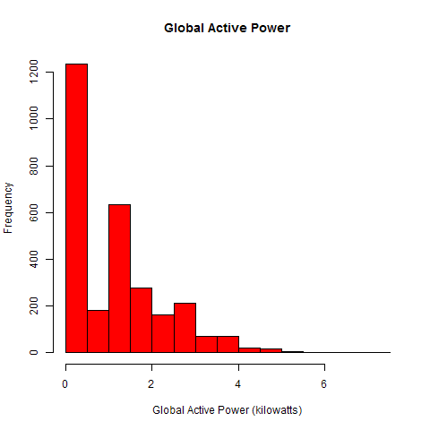
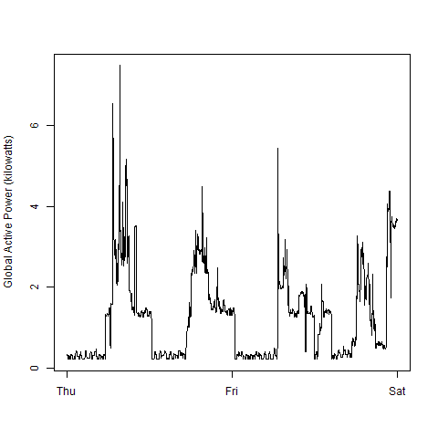
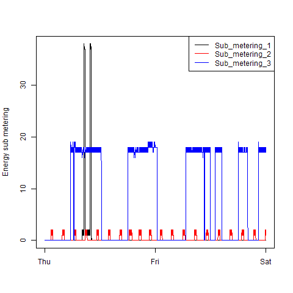
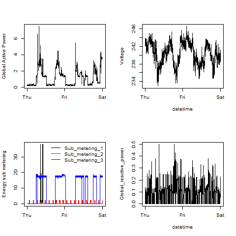

## Introduction

This repository contains scripts that generate the plots required for the Exploratory Data Analysis course of the Data Scientist Track on coursera.

## Assumptions

The script assumes that the data will always be available the given <a href="https://d396qusza40orc.cloudfront.net/exdata%2Fdata%2Fhousehold_power_consumption.zip">url</a>. If the data is not available at the working directory, it will try to download it from that URL.

It also assumes that the data will not change. The requirement for the script was to plot data between 2007-02-01 and 2007-02-02. These data are found from line 66638 and has 2880 entries. The script will only read that data.

## Implementation

The repository contains the following scripts:

### [plot.utils.R](plot.utils.R)

Contains utility functions and constants used for generating the plots. It contains the function used to download the zip file, and the function to write the plot to a *.png file.

### [plot.functions.R](plot.functions.R)

Contains functions that actually generate the plots. The developer decided to put all of the functions in one file as there are plots that are common to multiple required plots. The functions used by the plots are described below.

### [plot1.R](plot1.R)

Output: [plot1.png](plot1.png)
Plot Function: `hist.global.active.power()` in [plot.functions.R](plot.functions.R)

The `hist.global.active.power()` uses the `hist()` function on the Global Active Power data to generate the required plot.

### [plot2.R](plot2.R)

Output: [plot2.png](plot2.png)
Plot Function: `plot.active.power.to.date.time()` in [plot.functions.R](plot.functions.R)

The `plot.active.power.to.date.time()` uses the `plot()` function on the Global Active Power data against the Date-Time to generate the required plot. The `plot.active.power.to.date.time()` has a second optional parameter that controls the Global Active Power label. This is used when generating [plot4.png](plot4.png), which uses the same plot.

### [plot3.R](plot3.R)

Output: [plot3.png](plot3.png)
Plot Function: `plot.sub.metering.to.date.time()` in [plot.functions.R](plot.functions.R)

The `plot.sub.metering.to.date.time()` first uses the `plot()` function on the Sub Metering 1 data against the Date-Time to generate the required plot, but passes the `type = 'n'` parameter to generate an empty plot. It then calls the `line()` function on each of the Sub Metering data while setting the appropriate color. It then generates a legend on the top right of the plot using the `legend()` function.

### [plot4.R](plot4.R)
 
Output: [plot4.png](plot4.png)
Plot Function: `multi.plot()` in [plot.functions.R](plot.functions.R)

The function `multi.plot()` in turn calls the following functions also found in [plot.functions.R](plot.functions.R) to generate the plots:

* `plot.active.power.to.date.time()` - pass FALSE to second argument to display the correct y-axis label
* `plot.voltage.to.date.time()`
* `plot.sub.metering.to.date.time()` - pass FALSE to the second argument to not display the box around the legend
* `plot.reactive.power.to.date.time()`
 
`plot.voltage.to.date.time()` and `plot.reactive.power.to.date.time()` use the `plot()` function to plot the Voltage and Global Reactive Power against Date-Time respectively.

## Usage

All the plot*.R files must be in the same directory. In R, the user can then set the working directory to that directory, and call `source('plot<x>.R')`, where `<x>` is the number of the plot the user wants to generate. Sourcing the script will automatically generate the corresponding plot.

## Results

These are the reference and submitted plots compared side by side. Note that the reference plots are 504x504 pixels, while the generated plots are 480x480 pixels.

### Plot 1

| Reference | Submitted|
| --- | --- |
|  |  |

### Plot 2

| Reference | Submitted|
| --- | --- |
|  |  |

### Plot 3

| Reference | Submitted|
| --- | --- |
|  |  |

### Plot 4

| Reference | Submitted|
| --- | --- |
|  |  |
